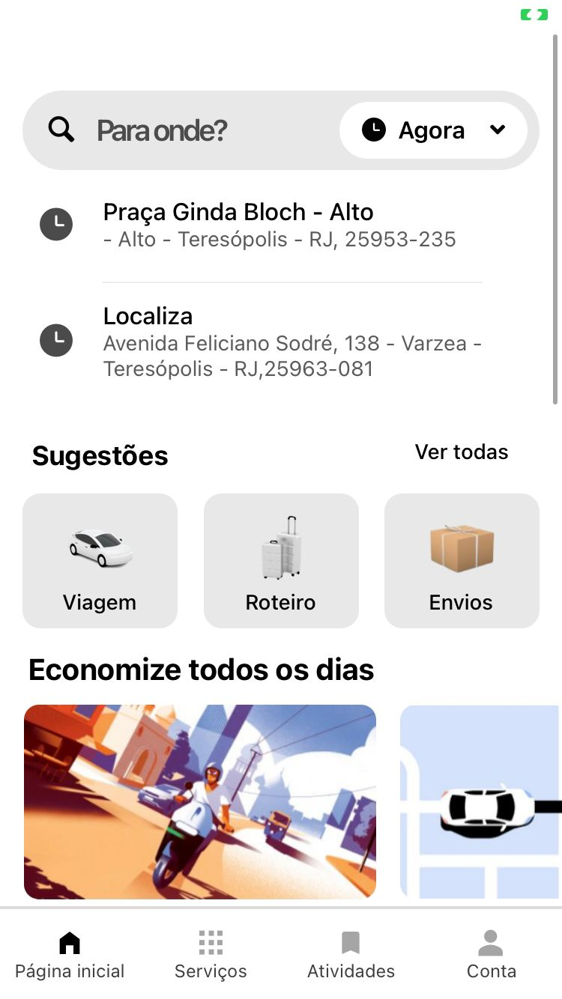
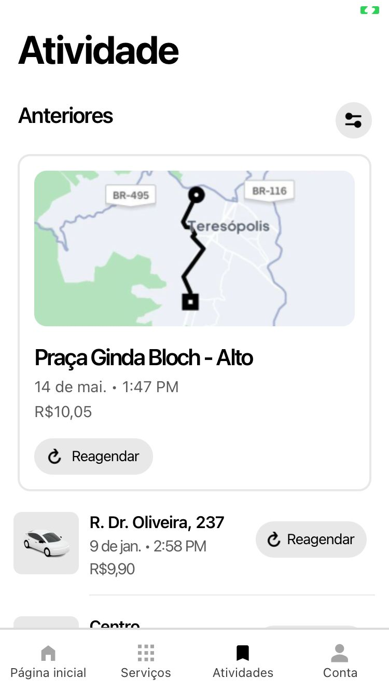

  

 

# CLONE APLICATIVO UBER

Desenvolvi um clone visual do aplicativo da Uber usando TypeScript, o projeto concentra-se em proporcionar semelhanças visuais notáveis, priorizando a recriação da experiência estética. 

### Apresento abaixo as imagens comparativas e um vídeo demonstrativo:

## Original:

  
  
  

## Clone:

  
  
  

## Video:
O vídeo apresenta uma comparação entre os dois aplicativos, exibindo inicialmente a versão ORIGINAL seguida pelo clone que desenvolvi.

  <video width="60%" controls>
    <source src="./comparativo/originalxClone.mp4" type="video/mp4">
    Seu navegador não suporta o elemento de vídeo.
  </video>

