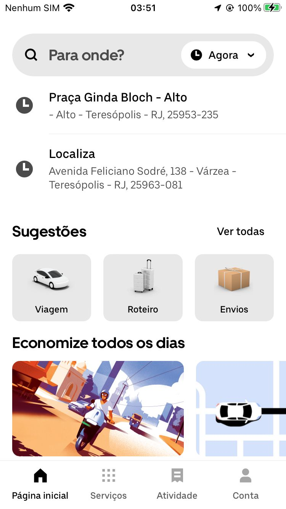
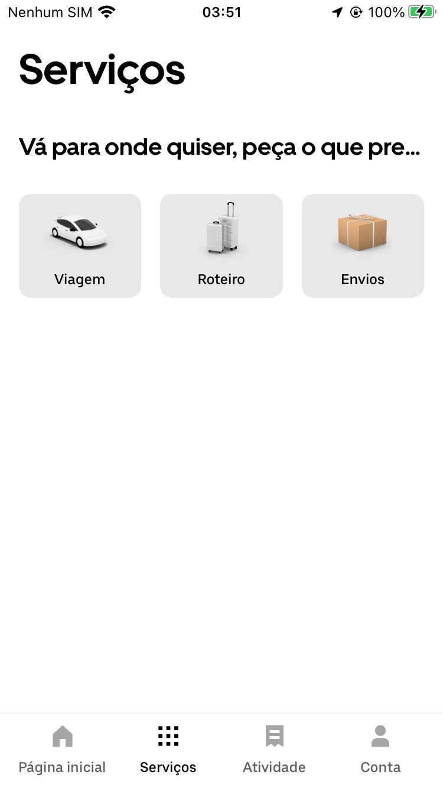
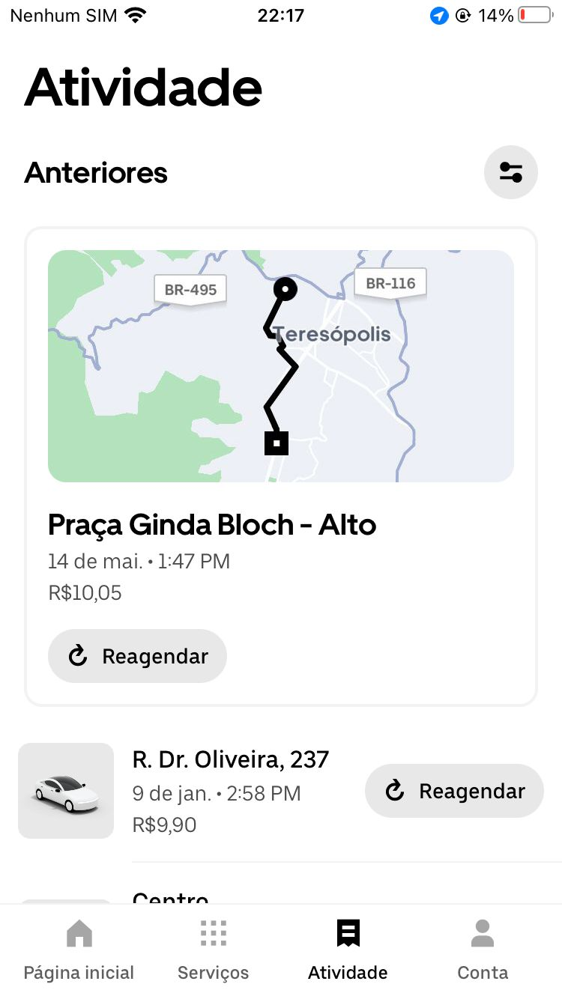

  

 

# CLONE APLICATIVO UBER

Desenvolvi um clone visual do aplicativo da Uber usando TypeScript, o projeto concentra-se em proporcionar semelhanças visuais notáveis, priorizando a recriação da experiência estética. 

### Apresento abaixo as imagens comparativas e um vídeo demonstrativo:

## Original:

  
  
  

## Clone:

  
  
  

## Video:

